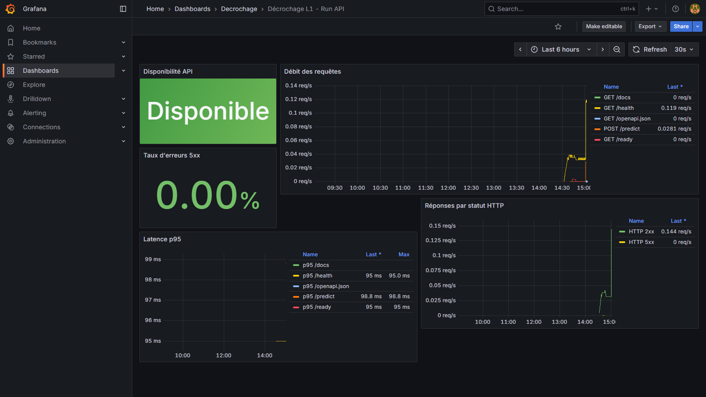
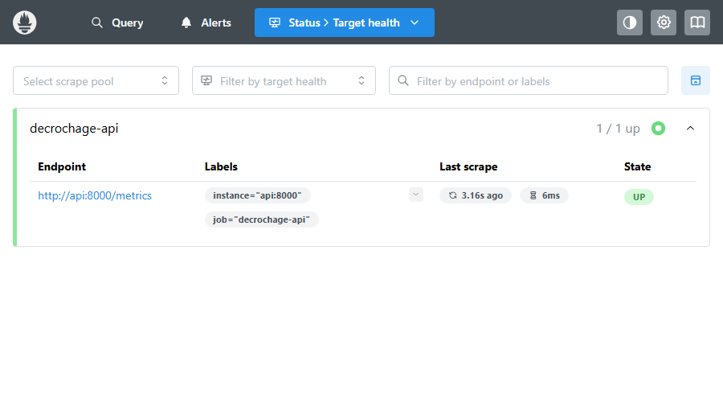
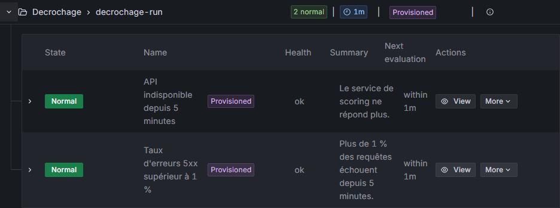
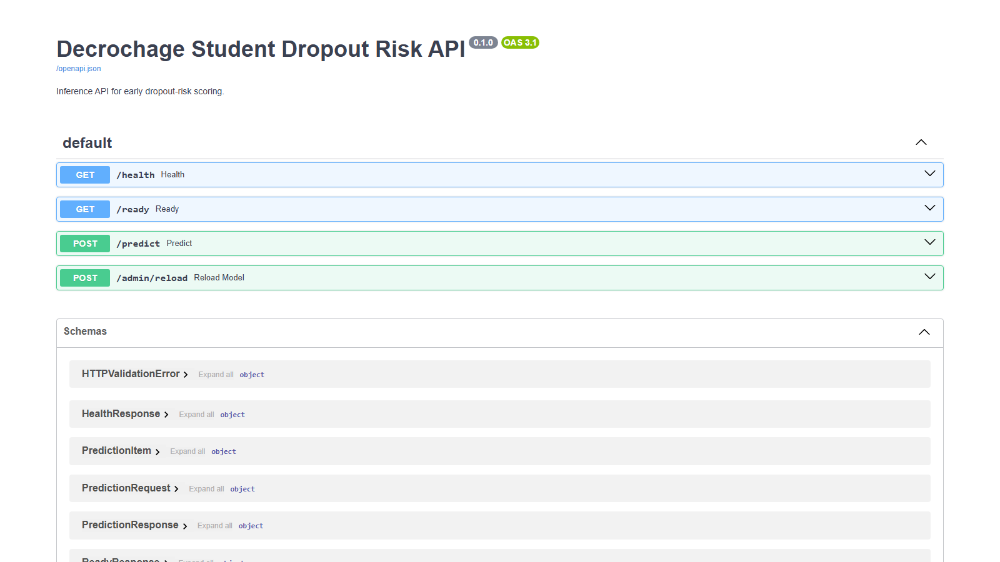
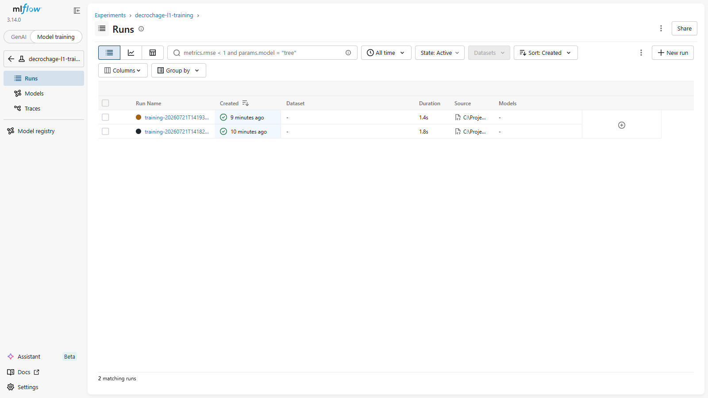
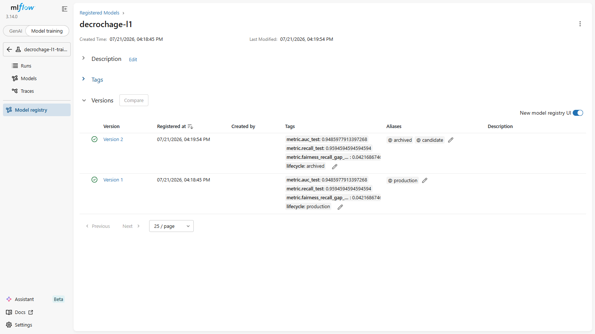

# Détection précoce du décrochage étudiant en L1

### Concevoir et implémenter une solution d'IA — soutenance de certification

**Staudt Michael** · *27/07/2026* · v1.5
Python 3.13 · scikit-learn · FastAPI · Postgres · MLflow · Prometheus/Grafana · C1→C9

📦 **Code, tests et documentation** : [github.com/MichaeLab34/examen](https://github.com/MichaeLab34/examen)

<!--
[0:30] Se présenter, annoncer le sujet en une phrase :
« Je vous présente une solution d'IA qui détecte, dès le milieu du premier
semestre, les étudiants de L1 en risque de décrochage, pour prioriser
l'accompagnement — de façon explicable et conforme au RGPD. »
Annoncer la durée et qu'on prendra les questions à la fin.
-->

---

## Fil conducteur

1. **Problème & cadrage** métier
2. **Données** et les 3 pièges à éviter
3. **Éthique & RGPD**
4. **Préparation** & anti-fuite
5. **Modèle** : choix, **coût de calcul**, entraînement, seuil
6. **Résultats** & explicabilité
7. **Industrialisation & Run** : API, Docker, registre, alertes, rollback
8. **Limites & recommandations**

<!--
[0:30] Donner la carte. Insister : « le fil rouge de ma démarche, c'est la
RIGUEUR anti-fuite et l'EXPLICABILITÉ, parce que ce sont des données
étudiantes sensibles. » Ne pas lire les 8 points un à un.
-->

---

## Ma démarche — et sa trace écrite

**10 journées documentées + un bilan final** → `notebooks/journal_de_bord.ipynb`.

| Jours | Décision structurante de la période |
|---|---|
| **1-3** | AUC > 0,95 au premier essai → deux fuites identifiées → **périmètre verrouillé dans le code** |
| **4-6** | Nettoyage en module · imputation **dans** la Pipeline · **seuil choisi par coût métier** |
| **7-9** | Package unique · médaillon + pseudonymisation · architecture · **Run vérifié dans Docker** |
| **10** | Relecture à froid → **mesurer** le coût de calcul au lieu de l'affirmer |
| **Bilan** | Ce que je referais à l'identique, ce qui reste à creuser |

> Chaque grande étape du notebook se termine par un encadré *JdB* : la décision **et** sa justification, écrites au moment où je les prends.

<!--
[1:00] Poser la méthode avant les résultats : le jury évalue le raisonnement
autant que le résultat. Message : « je ne présente pas un modèle qui marche,
je présente une suite de décisions que je peux toutes justifier — et je les ai
écrites au fur et à mesure, pas reconstruites après coup. »
Ne pas détailler les 10 jours : citer seulement le déclencheur du jour 1
(l'AUC anormalement haute) qui a donné le fil rouge de tout le projet.
-->

---

## 1. Contexte & problème métier — C1

- Une université observe un **fort taux d'abandon en L1** (~28 % ici).
- Besoin : **agir tôt** (mi-S1) avec des ressources limitées (tuteurs, aides).
- Aujourd'hui : repérage **trop tardif** (après les partiels).

**Problématique métier** : *quels étudiants accompagner en priorité, dès mi-S1 ?*
**Problématique IA** : *estimer une probabilité de décrochage, explicable, à
partir des seules données disponibles à mi-S1.*

<!--
[1:00] Raconter le problème comme une histoire, pas comme une fiche.
Le point clé à faire passer : la contrainte « MI-S1 » conditionne tout
(elle interdit certaines variables — j'y reviens au slide des pièges).
« Le modèle n'est qu'une aide à la décision : l'humain garde la main. »
-->

---

## 2. Objectif IA & cadrage — C1

Deux cibles, deux usages :

| Cible | Type | Usage |
|---|---|---|
| `abandon` (0/1) | **Classification** (principale) | Prioriser l'accompagnement — ROC/AUC |
| `moyenne_finale` (/20) | **Régression** (secondaire) | Calibrer l'intensité de l'aide |

- Sortie = un **score de risque** + une **alerte** (seuil), pas un verdict.
- Enrichissement : **catalogue des formations** (taux de réussite historique).

<!--
[1:00] Justifier pourquoi c'est de la CLASSIFICATION (décision oui/non
d'accompagner) et pas juste de la régression. La régression est un COMPLÉMENT
pour calibrer l'intensité. Question jury probable : « pourquoi pas prédire
seulement la note ? » → parce que la décision métier est binaire.
-->

---

## 3. Les données et les 3 PIÈGES — C1 / C3

~5 200 étudiants, 33 colonnes, volontairement **« brutes »**.

| Piège | Colonnes | Décision |
|---|---|---|
| **Fuite de données** | `moyenne_finale` | exclue des features |
| **Fuite temporelle** | `moyenne_partiels_s1`, `nb_ue_validees_s1` | hors périmètre mi-S1 |
| **Leurres** | `groupe_td`, `couleur_carte_etudiante`, `jour_inscription` | prouvés inutiles, exclus |

+ exclure identifiants, constantes, texte libre brut.

> 🔒 Périmètre de scoring **codé et verrouillé** + garde-fou `assert_no_leakage`.

<!--
[2:30] SLIDE LA PLUS IMPORTANTE. Prendre le temps.
- Fuite de données : moyenne_finale est un résultat de FIN de semestre,
  corrélé au décrochage → l'utiliser = tricher.
- Fuite temporelle : les résultats consolidés de fin de S1 ne sont PAS
  disponibles à mi-S1 → performance flatteuse mais modèle inutilisable.
- Leurres : je ne me contente pas de les retirer, je PROUVE (EDA) qu'ils
  n'ont pas de signal.
Conclure : « et pour ne jamais me tromper, j'ai un garde-fou qui plante si une
colonne interdite entre dans le modèle. »
-->

---

## 4. Éthique, RGPD & biais — C2

- **Variables sensibles** : `sexe`, `boursier`, origine → risque de **biais**
  (direct et indirect via proxys).
- **Effet de marquage** : étiqueter « à risque » n'est pas neutre.
- **RGPD** : finalité limitée (aide ≠ sanction), information, **décision humaine**
  (pas d'automatisation — art. 22).
- **Protection appliquée (C2)** : Bronze brut restreint, Silver pseudonymisé HMAC,
  Gold sans identifiants directs, rétention/purge et audit `privacy_audit_log`.
- **Secrets hors Git** : `.env` local ignoré, `.env.example` versionné.

**Garde-fous** : explicabilité · audit d'équité par sous-groupes · usage encadré ·
minimisation · pseudonymisation · accountability.

<!--
[1:30] Montrer une vraie conscience éthique — c'est très regardé (C2 a un
questionnaire séparé). Question piège classique : « en retirant le sexe, votre
modèle est-il non-discriminant ? » → NON, des proxys corrélés peuvent réintroduire
un biais → d'où l'audit d'équité que je montre plus loin.
-->

---

## 5. Préparation des données — C3

Chaîne **déterministe** et reproductible :

- **dédoublonnage** (40 doublons → 5 200 lignes) ;
- **nombres en texte** → float : « 61,8 » · « 61.4% » · « 14.4 km » ;
- **dates multi-formats** → parsées ;
- **encodages** harmonisés (`sexe`, `bac_type`, `mention_bac`, `boursier`…).

**Silver** = données nettoyées et pseudonymisées.  
**Gold** = source unique de modélisation : features mi-S1, labels et split.

Le notebook construit `X`, `y_clf` et `y_reg` **uniquement depuis le Gold dataset**.

> ⚠️ L'**imputation vit dans la Pipeline**, pas dans le nettoyage : médiane et mode
> sont appris sur le train seul, sinon le test fuite vers l'entraînement.

<!--
[1:00] Insister sur 3 idées défendables :
1. Le nettoyage est dans un MODULE → rejoué à l'identique en production.
2. Silver pseudonymise, Gold sert réellement à entraîner/scorer.
3. On impute DANS la pipeline (pas avant le split) sinon fuite du test.
Montrer 1-2 exemples concrets de valeurs sales (« 14.4 km »).
-->

---

## 6. EDA — facteurs de risque & preuve des leurres — C3


- Décrocheurs = **moins de présence/LMS**, **plus de retards**, motivation basse.
- Leurres : taux d'abandon **plat** entre modalités — écart-type **1,6 à 2,3 pts**
  selon le leurre → **aucun signal**, je le montre au lieu de l'affirmer.

<!--
[1:00] Montrer le graphe des densités par classe (présence, LMS, rendus...).
« On voit visuellement que les signaux d'engagement séparent bien les deux
groupes. » Puis mentionner le graphe des leurres (eda_leurres.png) : « et voici
la preuve que les leurres n'apportent rien. » Tu peux mettre eda_leurres.png en
2e image si la place le permet.
-->

---

## 7. Choix du modèle — C4

Démarche : **baseline** → comparer 3 familles, évaluées par **AUC**.


**Retenu : régression logistique** — **aucun gain d'AUC significatif** du boosting,
et c'est le modèle le plus **explicable** et le plus **sobre**.

*Arbitrage assumé : explicabilité > gain marginal non significatif.*

<!--
[1:00] Justifier AUC (insensible au seuil et au déséquilibre, contrairement à
l'accuracy). Montrer les courbes ROC superposées. Le message : « à performance
égale, je choisis le modèle le plus EXPLICABLE et le plus SOBRE — c'est ce
qu'exige le contexte. » Question probable : « pourquoi pas XGBoost ? » → pas de
gain d'AUC ici, et moins explicable.
-->

---

## 7.1 Éco-conception : ce que coûte un point d'AUC — C4

Le coût de calcul est **mesuré** pendant la comparaison (CodeCarbon, mix français) :

| Modèle | Coût de calcul | AUC validation | Coût / point d'AUC |
|---|---|---|---|
| **Régression logistique** *(retenu)* | référence **× 1** | **0,949** | — |
| XGBoost | **~ × 10** | 0,948 | **∞** (aucun gain) |
| Random Forest | **~ × 20 à 30** | 0,942 | **∞** (aucun gain) |

> Quelques centièmes de Wh pour toute la comparaison : dérisoire dans l'absolu.
> La sobriété se joue ailleurs que sur l'algorithme → slide suivante.
>
> *Ordres de grandeur : la mesure varie avec la charge machine, l'écart entre modèles non.*

<!--
[0:45] Point souvent survolé : je l'ai MESURÉ au lieu de l'affirmer.
Message : le boosting coûte un ordre de grandeur de plus pour zéro gain — le coût par
point d'AUC est infini, l'arbitrage est tranché par les chiffres et non par une
préférence personnelle.
Limite à assumer si on questionne : sous Windows la mesure CPU est approximative,
elle sert à comparer les modèles entre eux, pas à publier une empreinte absolue.
Enchaîner tout de suite sur les leviers : quelques centièmes de Wh, ce n'est pas là
que ça se joue. Chiffres exacts du dernier run dans le notebook §8.3 si on les demande.
-->

---

<style scoped>
table { font-size: 0.78em; }
</style>

## 7.2 Les 6 leviers d'éco-conception — C4 / C7

| Levier | Décision prise | Effet |
|---|---|---|
| **1. Fréquence de réentraînement** | annuelle, par cohorte — pas mensuelle (§16) | **~11 entraînements évités par an** |
| **2. Choix du modèle** | régression logistique plutôt que boosting | entraînement et inférence négligeables, pas de GPU |
| **3. Dimensionnement** | VPS conteneurisé, pas de Kubernetes (§15) | pas de cluster inactif à alimenter |
| **4. Minimisation des données** | 31 features ; texte libre réduit à un booléen | moins de stockage et de calcul, moins de risque RGPD |
| **5. Rythme de scoring** | un batch par semestre, pas de temps réel | pas de service de scoring permanent sous charge |
| **6. Rétention** | purge automatique des lots expirés (§14) | stockage borné dans le temps |

> **Quatre leviers sur six** relèvent de l'architecture et de l'exploitation, pas de la modélisation — et deux d'entre eux (4 et 6) servent aussi le RGPD.

<!--
[0:45] LE message de la séquence éco-conception : le levier le plus fort n'est pas
l'algorithme mais le fait de NE PAS RECALCULER ce qui n'a pas besoin de l'être.
Mensuel → annuel = 11 entraînements complets économisés ; changer d'algorithme
économise un facteur 12 sur quelques secondes. Ce n'est pas le même ordre.
Si le jury enchaîne sur le RGPD : les leviers 4 et 6 réduisent à la fois
l'empreinte et la surface de données personnelles.
-->

---

## 8. Entraînement & validation — C5

- **Split stratifié** train / validation / test (test jamais utilisé pour choisir le seuil).
- **Tuning** de la régularisation `C` par validation croisée stratifiée (scoring AUC).
- **Déséquilibre** (~28 %) : `class_weight="balanced"` (pas de sur-échantillonnage agressif).
- **Seuil métier** choisi sur validation, puis évalué sur test hold-out.
- **AUC CV ≈ AUC test** → pas de surapprentissage visible.

<!--
[1:00] Rassurer sur la robustesse : le fait que l'AUC en validation croisée
égale l'AUC sur le test hold-out prouve qu'on ne surapprend pas. Expliquer
pourquoi pondération plutôt que SMOTE : préserve la calibration des probabilités.
Point important : le test final n'a pas servi à choisir le seuil.
-->

---

## 9. Choix du seuil — raisonner en coût métier — C5 / C8


- **Manquer un décrocheur (FN)** coûte plus cher qu'une alerte inutile (FP).
- Ratio **FN:FP = 5:1** (hypothèse métier explicite) → seuil ≈ **0,30** sur validation.
- Résultat test : **rappel 95,9 %** (on rate très peu de décrocheurs), précision **63,5 %**.

<!--
[1:30] C'est un slide qui impressionne : montrer qu'on ne prend pas 0,5 par
défaut mais qu'on OPTIMISE un coût métier sur validation. Assumer que le ratio 5:1 est une
hypothèse à valider avec la direction. Lien direct avec l'objectif : ne pas
laisser des étudiants décrocher.
-->

---

## 10. Résultats — performance — C8


| Indicateur | Valeur |
|---|---|
| AUC (test) | **0,949** |
| Rappel (seuil métier) | **0,96** |
| Précision | 0,64 |

<!--
[1:00] Lire la matrice de confusion : « au seuil retenu, je détecte 96 % des
futurs décrocheurs. » Assumer la précision plus basse (64 %) : c'est un choix —
mieux vaut quelques accompagnements en trop qu'un décrocheur raté. Coût d'un FN
>> coût d'un FP.
-->

---

## 11. Explicabilité & équité — C8 / C2


- Facteurs **actionnables** : présence, LMS, rendus, motivation.
- **Audit d'équité** : rappel comparable F/M/boursier (**0,935–0,975**) →
  écart maximal **1,9 pt**, très en deçà du seuil d'alerte de **10 pts**.

<!--
[1:00] Deux messages : (1) le modèle n'est pas une boîte noire — SHAP et
l'importance des variables montrent des facteurs sur lesquels on peut AGIR
(relance, tutorat). (2) J'ai vérifié l'équité entre sous-groupes sensibles :
pas d'écart marqué. Tu peux aussi montrer importance_permutation.png.
-->

---

## 12. Cible secondaire — régression `moyenne_finale` — C8


- Estime la moyenne finale attendue → **calibrer l'intensité** de l'aide.
- R² ≈ **0,68**, erreur ≈ 2,3 pts/20.
- Reste **exclue des features** de classification (fuite).

<!--
[0:30] Court. Montrer que la régression est utile pour NUANCER (soutien léger vs
renforcé), sans prétendre prédire une note exacte. Rappeler qu'on ne s'en sert
JAMAIS pour prédire abandon.
-->

---

## 13. Implémentation & service — C6

- **Bundle sérialisé** (joblib) : Pipeline + features + seuil + catalogue + métadonnées.
- Package `decrochage` : `training.py`, `serving.py`, `api.py`, `cli.py`,
  `persistence.py`, `monitoring.py`, `tracking.py`, `scheduler.py`.
- **Contrats industrialisés** : CLI batch, API FastAPI `/predict`, bundle rechargeable hors notebook.
- **Sécurité API** : clé, limite de débit, requêtes corrélées sans journaliser les données.
- **Cycle de vie** : runs MLflow (paramètres, métriques, artefacts), registre + rollback.
- **Observabilité** : `/metrics`, dashboard Grafana provisionné, alertes et heartbeat.
- **Qualité** : 59 tests `pytest`, lint/format, CI GitHub Actions, Dockerfile non-root.
- Documentation : architecture, modèle, menace, monitoring, guide d'industrialisation.

<!--
[1:00] Montrer qu'on va « du notebook au service puis au Run » : le notebook
explique, le package exécute, et le registre permet de maîtriser les versions.
Mentionner train, predict, drift-report, model-register/promote/rollback.
-->

---

## 14. Persistance SQL & architecture médaillon — C7

**Ingestion → Bronze → Silver → Gold → Entraînement/Scoring → API/CLI → Monitoring**

| Couche | Rôle | Données personnelles |
|---|---|---|
| Bronze | lignes sources brutes, traçabilité | restreintes, purgées |
| Silver | nettoyage + normalisation | IDs remplacés par HMAC |
| Gold | features, split, scores, drift | pas d'identifiants directs |

Stack locale production-like : **Postgres via Docker Compose**.  
Fallback dev : SQLite local ignoré par Git.

<!--
[1:00] Faire le lien avec les exigences RGPD (C2/C7) : Bronze reste brut parce que c'est la
zone de preuve et de reprise, mais elle est restreinte. Silver pseudonymise.
Gold est la seule source de modélisation et de scoring. Mentionner la commande :
decrochage medallion-load.
-->

---

## 15. Architecture d'exploitation proportionnée — C7

**~5 200 étudiants/an · batch mi-S1 · API peu sollicitée**

| Choix | Décision adaptée au projet |
|---|---|
| Hébergement | **VPS européen conteneurisé** ; serverless à réévaluer, Kubernetes écarté |
| Sécurité réseau | **Caddy** reverse-proxy + HTTPS automatique |
| Données | Postgres sur le VPS, sauvegarde hors hôte, secrets hors Git |
| Disponibilité | `/health` + `/ready` ; pas de haute disponibilité sans SLA |
| Budget indicatif | **10–20 €/mois**, +5–10 € pour un environnement de test |

La portabilité vient des conteneurs : évoluer plus tard sans réécrire le service.

<!--
[1:00] Présenter le principe d'architecture : dimensionner pour le besoin réel.
Le trafic est faible et rejouable : Kubernetes n'apporte rien aujourd'hui.
Les montants sont des ordres de grandeur à confirmer par la DSI, pas des devis.
-->

---

## 16. Cycle de vie du modèle — C9

1. **Contrôler chaque batch** : qualité + PSI (`watch` ≥ 0,10 ; `alert` ≥ 0,25).
2. **Dérive sans labels frais** : investiguer la collecte, ne pas réentraîner à l'aveugle.
3. **Labels de la nouvelle cohorte disponibles** : entraîner un `candidate` annuel.
4. **Tracer l'expérience** : paramètres, métriques et bundle dans un run MLflow.
5. **Gate** : AUC ≥ 0,85 · rappel ≥ 0,90 sans régression · écart équité ≤ 10 pts.
6. **Validation humaine obligatoire**, puis alias MLflow `production` ou rollback.

APScheduler contrôle puis évalue la politique chaque semaine ; l'échéance
annuelle reste un déclencheur. Un
redémarrage le même jour ne crée pas de doublon.

<!--
[1:00] Dans ce contexte, un réentraînement mensuel
n'a pas de sens car la vérité terrain arrive après la cohorte. Le déclencheur
drift ouvre une investigation ; il n'autorise un entraînement que si les labels
frais existent. Le candidat du notebook passe le gate technique (écart F/M et
boursier = 1,9 pt) mais reste « en attente » sans approbation humaine.
-->

---

## 17. Supervision et alertes — C8 / C9

| Besoin | Réponse |
|---|---|
| Quotidien | canal d'équipe réussite étudiante / DSI |
| Vue Run | dashboard Grafana : disponibilité, débit, statuts HTTP, latence p95 |
| Incident technique | API indisponible ou 5xx > 1 % **pendant 5 min** |
| Tâche silencieuse | heartbeat externe : contrôle drift/réentraînement attendu mais absent |
| Critique | astreinte DSI seulement pendant la fenêtre de scoring |

**Hystérésis + cooldown 24 h** : une dérive persistante ne spamme pas l'équipe.

<!--
[0:45] Expliquer le dead-man's switch : un job qui ne démarre plus n'émet
aucune erreur. Il doit donc envoyer un « je suis passé » ; l'absence du signal
déclenche l'alerte. L'astreinte 24/7 permanente serait disproportionnée ici.
-->

---

## 17.1 Grafana confirme un service disponible



- Disponibilité, débit par route, erreurs 5xx et latence p95 sont visibles en conditions réelles.
- Les mesures proviennent de l'API conteneurisée et de Prometheus, pas de sorties calculées dans le notebook.

<!--
[2:00] BLOC DE 6 CAPTURES — les faire défiler d'un trait, sans commenter chacune.
Un seul message : « ces preuves ne peuvent pas sortir d'un notebook, ce sont des
processus réseau, vérifiés dans la stack Docker avec Playwright. »
Ne détailler (Prometheus UP, 2 règles Grafana, rollback MLflow, log JSON borné)
que si le jury pose la question.
-->

---

## 17.2 Prometheus collecte l'API



- La cible `decrochage-api` est collectée sur `/metrics`, état `UP`.

---

## 17.3 Grafana évalue les alertes



- Deux règles provisionnées : indisponibilité de l'API, taux d'erreurs 5xx > 1 %.

---

<style scoped>
section img { max-height: 44vh; }
</style>

## 17.4 Caddy expose l'API en HTTPS



- Caddy termine HTTPS et transmet les requêtes au conteneur API.
- Certificat local pour la démonstration ; domaine et certificat gérés en production.

> Ces preuves ne peuvent pas sortir du notebook seul : Caddy, Prometheus et Grafana sont des processus réseau indépendants.

<!--
Le notebook prouve la démarche analytique ; ces captures prouvent l'exploitation
réelle : HTTPS, collecte périodique, dashboard et évaluation continue des alertes.
-->

---

## 17.5 MLflow trace les entraînements



- Chaque entraînement enregistre paramètres, métriques, rapport JSON et bundle modèle.
- Deux runs indépendants sont visibles dans `decrochage-l1-training`.

---

## 17.6 Versions, promotion et rollback



- La version 2 a été promue après validation humaine, puis archivée lors du rollback.
- L'alias `production` référence de nouveau la version 1, chargée par l'API.
- `/ready` expose `model_version=1` et `model_alias=production`.

---

## 17.7 Journaux JSON corrélés et bornés

```json
{"timestamp":"2026-07-21T14:05:24+00:00","level":"INFO","event":"api_request","request_id":"jury-log-proof-001","method":"GET","path":"/health","status":200,"duration_ms":2.45}
```

- Une ligne JSON par requête, sans payload étudiant ni clé API.
- `X-Request-ID` relie la réponse utilisateur au journal technique.
- Rotation Docker : **10 Mo par fichier, 5 fichiers conservés**.

<!--
Montrer l'interface MLflow : deux runs, paramètres, métriques et artefacts.
Puis montrer le registre : la version 1 est revenue en production après rollback.
Conclure avec le log JSON corrélé et la rétention locale bornée.
-->

---

## 18. TCO & valeur du pilote — C7 / C9

- **TCO** = hébergement + sauvegardes + temps DSI/DPO + revue du modèle + interventions.
- Le coût d'infrastructure seul ne mesure pas la valeur du dispositif.
- Formule pilote :
  **étudiants utilement accompagnés × effet causal du dispositif**.
- L'AUC mesure la discrimination du modèle, **pas** l'impact du tutorat.
- Mesure attendue : pilote progressif / A-B test, capacité des tuteurs, faux positifs.

> Aucun gain financier inventé : les hypothèses doivent être validées avec l'université.

<!--
[1:00] Adapter le ROI industriel au contexte éducatif. On ne dispose pas d'un
coût officiel du décrochage ni de l'uplift causal de l'accompagnement. La bonne
réponse est de proposer la méthode de mesure, pas de fabriquer un chiffre.
-->

---

## 19. Les arbitrages — ce que j'ai failli faire

| Réflexe de départ | Pourquoi je ne l'ai pas suivi |
|---|---|
| Garder `moyenne_partiels_s1` (« c'est du S1 ! ») | consolidée en **fin** de S1 → vide au moment du scoring |
| Imputer avant le split | la médiane du jeu entier fait fuiter le test vers le train |
| Prendre **XGBoost** (réflexe tabulaire) | aucun gain d'AUC significatif, et coefficients illisibles |
| Laisser le seuil à **0,5** | suppose FN = FP ; ici le coût réel est **5:1** |
| Réentraîner **tous les mois** | les labels d'abandon n'arrivent qu'après la cohorte |
| Traduire l'AUC en **euros économisés** | l'AUC mesure la discrimination, pas l'effet du tutorat |
| Déployer sur **Kubernetes** | 5 200 étudiants/an : un VPS conteneurisé suffit |

> Chacun de ces arbitrages est daté et justifié dans le journal de bord.

<!--
[1:30] LE slide qui répond à « le raisonnement compte autant que le résultat ».
Ne pas tout lire : en développer 2 ou 3 (la fuite temporelle, le seuil, le
réentraînement mensuel) et laisser le tableau parler pour le reste.
Message : « à chaque fois, le réflexe courant aurait donné un chiffre plus
flatteur ou une archi plus impressionnante — et un dispositif moins valide. »
-->

---

## 20. Limites & recommandations

- **Données synthétiques** → AUC élevée à revalider sur données réelles.
- **Corrélation ≠ causalité** → A/B test nécessaire avant conclusion business.
- **Production réelle** : DPO, DPIA/AIPD, RBAC DB, coffre de secrets, dashboards.
- **Run réel** : confirmer le TCO avec la DSI, brancher le canal d'alerte et tester les sauvegardes.
- **Éthique** : surveiller l'équité en continu, documenter les recours.
- Le score **priorise**, il ne **décide** pas.

<!--
[1:00] Montrer de la lucidité — le jury valorise un candidat qui connaît les
limites de son travail. NE PAS survendre. « Ce que j'ai construit est une
démarche solide et reproductible ; sa validité en production reste à confirmer
sur données réelles. »
-->

---

## 21. Conclusion — du modèle au Run, C1→C9

- **Rigueur anti-fuite** (3 pièges neutralisés + garde-fou).
- **Modèle explicable** performant (AUC 0,95, rappel 95,9 %).
- **Seuil calibré** sur le coût métier.
- **Prototype Run vérifiable** : HTTPS, métriques, alertes, heartbeat, promotion humaine et rollback.
- **RGPD documenté et implémenté** dès la persistance.

📦 Code complet, tests, CI et documentation : **[github.com/MichaeLab34/examen](https://github.com/MichaeLab34/examen)**

**Merci — vos questions ?**

<!--
[1:00] Résumer en 30 s les 5 messages. Terminer par la valeur métier : « une
aide concrète pour accompagner à temps les étudiants à risque. » Enchaîner sur
les questions avec assurance.
-->

---

<!-- _paginate: false -->
<style scoped>
section { font-size: 21px; }
</style>

## Backup — questions probables du jury

- **Fuites ?** → 3 pièges + `assert_no_leakage` + périmètre codé.
- **AUC 0,95 = fuite ?** → non : verrou + données synthétiques ; à revalider.
- **Pourquoi LogReg et pas XGBoost ?** → même AUC, plus explicable, et **un ordre de grandeur de calcul en moins** (mesuré).
- **Éco-conception ?** → coût mesuré par modèle, coût/point d'AUC, 6 leviers ; le principal est la fréquence de réentraînement.
- **Choix du seuil ?** → minimisation du coût métier sur validation (FN >> FP).
- **Équité / RGPD ?** → audit sous-groupes + décision humaine + minimisation.
- **Bronze contient du brut ?** → oui, zone restreinte de traçabilité ; Silver/Gold protègent l'usage.
- **Drift en production ?** → `decrochage drift-report` + Gold SQL + seuils PSI + ré-entraînement.
- **Pourquoi pas mensuel ?** → les labels d'abandon arrivent par cohorte ; drift = investigation, pas entraînement aveugle.
- **Modèle dégradé ?** → gate rappel/AUC/équité, approbation humaine, alias MLflow et rollback.
- **Pourquoi pas Kubernetes ?** → faible volume, batch rejouable ; VPS conteneurisé proportionné.
- **Job qui ne tourne plus ?** → heartbeat externe : l'absence de ping déclenche l'alerte.
- **ROI ?** → TCO chiffré, valeur mesurée par pilote causal ; aucun gain inventé à partir de l'AUC.

<!--
Slide de secours, à ne PAS présenter : à garder sous la main pendant les 30 min
de questions. Prépare 1-2 phrases pour chacune à l'avance.
-->

---

<!-- _paginate: false -->
<style scoped>
table { font-size: 0.74em; }
</style>

## Backup — traçabilité C1 → C9

| Compétence | Preuve | Où |
|---|---|---|
| **C1** Cadrage & données | besoin, deux cibles, sources, gouvernance | notebook §2-3 + *JdB* |
| **C2** Éthique & conformité | proxys, RGPD, art. 22, audit d'équité | notebook §4 · §12.4 · `docs/rgpd_accountability.md` |
| **C3** Préparation | dédoublonnage, parsing, imputation Pipeline, features | notebook §5-7 · `preprocessing.py` · `features.py` |
| **C4** Choix du modèle | baseline + 3 familles, ROC/AUC, coût de calcul mesuré | notebook §8 · §8.3 · `ecodesign.py` |
| **C5** Entraînement | split 3 voies, CV stratifiée, seuil par coût | notebook §9 · `training.py` |
| **C6** Implémentation | bundle joblib, CLI, API FastAPI, contrat I/O | notebook §10 · `serving.py` · `api.py` |
| **C7** Architecture | médaillon, contraintes, dimensionnement, éco-conception, TCO | notebook §11 · `ARCHITECTURE_PROJET.md` |
| **C8** Performance & impacts | AUC/rappel/F1, SHAP, équité, régression | notebook §12 |
| **C9** Amélioration continue | PSI, politique de réentraînement, MLflow, alertes | notebook §13 · `monitoring.py` · `operations.py` |

Journal de bord : `notebooks/journal_de_bord.ipynb` — 10 journées datées + bilan.

Tous ces chemins sont consultables sur **[github.com/MichaeLab34/examen](https://github.com/MichaeLab34/examen)**.

<!--
Slide de secours pour un jury qui coche un référentiel : permet de pointer
immédiatement la preuve demandée. À ne pas présenter spontanément.
-->
